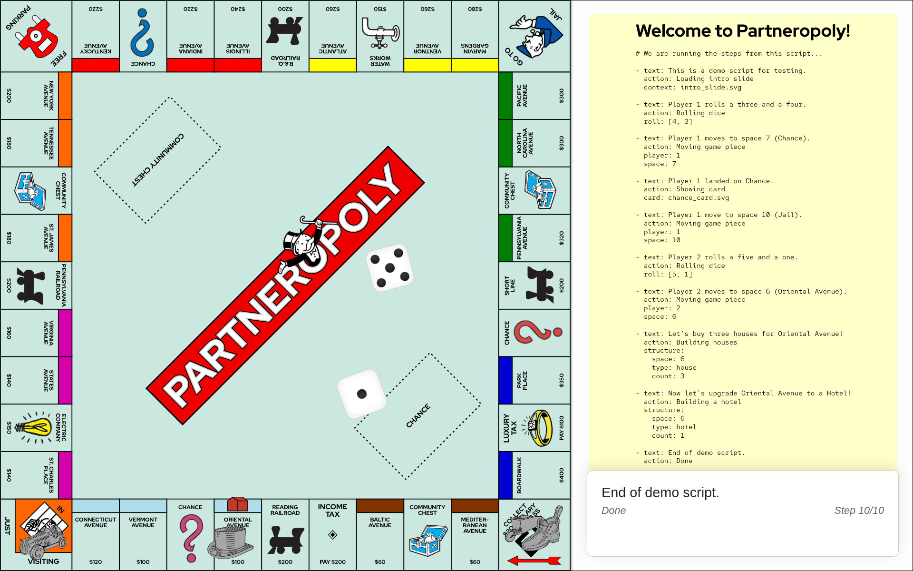

# Partneropoly

Partneropoly is a board game where players learn by negotiating the challenges of partner relationships in business. Do not pass "Go" and do not collect $200. Do have fun avoiding bankruptcy by eliminating toil and inefficiency. Watch your back!

## What's here

The Partneropoly Narrative Engine is a presentation tool designed to tell linear stories using a dynamic, 3D-animated game board. Unlike a real video game where rules are enforced automatically, this engine acts like a digital puppet show: you write the script, and the engine performs exactly what you tell it to do, step-by-step.

### Serve it up

Copy the `partneropoly` directory to your web server or host it locally using `python -m http.server` and go to http://localhost:8000 in your browser.

### How to present

Once the application is running:

- **Space Bar:** Advance to the next step in your script.
- **Left Arrow:** Go back to the previous step.
- **Esc Key:** Manually close a pop-up card (though they will also close automatically when you move to the next step).

## Writing your script

The script is a list of steps. Each step is listed using YAML syntax as explained below. Replace the example [`script.yaml`](partneropoly/script.yaml) with your own script.

### 1. The basics: text & action

Every step must have a main story text. Optionally, you can add an "action note" that appears in the small box below the story text.

```yaml
- text: Welcome to our presentation today.
  action: Just getting started
```

### 2. Rolling dice

To trigger the 3D dice animation, add the roll command with two numbers inside brackets. This is visual only. You must manually calculate the destination space and add a move command (see below) if you want the player's piece to move.

```yaml
- text: Bob rolls a three and a four.
  action: Rolling dice
  roll: [3, 4]
```

### 3. Moving players

To move a game piece, specify the player number (1–4) and the destination space number (0–39).

- **Player 1:** car
- **Player 2:** hat
- **Player 3:** wheelbarrow
- **Player 4:** boot

Note that you can change the game pieces by providing your own `playerN.svg` files.

The board spaces are numbered with GO being space 0 and subsequent space numbers increasing clockwise around the board, ending with Boardwalk being space 39.

```yaml
- text: Bob advances seven spaces to land on Chance.
  action: Moving game piece
  player: 1
  space: 7
```

### 4. Displaying cards

You can pop up a card (like Chance or Community Chest) that overlays the center of the screen. You must provide the exact filename of the SVG image. The card will disappear automatically when you advance to the next step or you can use the Esc key.

```yaml
- text: Bob landed on Chance!
  action: Showing card
  card: chance_card.svg
```

### 5. Building houses and hotels

You can place buildings on specific spaces. You must specify the space, the type ("house" or "hotel"), and the count. Adding buildings replaces whatever was previously on that space. To clear a space, set the count to 0.

```yaml
- text: Bob is buying three houses for Boardwalk.
  action: Building houses
  structure:
    space: 39 
    type: house
    count: 3
```

```yaml
- text: Mary is erecting a hotel on St. James Avenue.
  action: Building a hotel
  structure:
    space: 16
    type: hotel
    count: 1
```

In addition to building houses and hotels, you can simalarly display any drawing you like on a space using a blueprint command like this.

```yaml
- text: Let's try putting a blueprint on Oriental Avenue
  action: Showing a drawing file on space 6
  blueprint:
    space: 6
    file: blueprint4.svg
```

### 6. Loading content in the right pane

The right-hand panel is your "Context Stage" area. You can use it to display charts, graphs, or images that support your narrative. The image will persist until you replace it with a new context command.

```yaml
- text: Let's look at the quarterly projections.
  action: Updating chart
  context: quarterly_chart.svg
```

## Screenshot

Here's an example of what you should see after advancing through all the steps in the example script.



## Credits

Special thank you to:

- The Parneropoly board was derived from a work by [logotta2](https://seeklogo.com/user/logotta2) ([source](https://seeklogo.com/vector-logo/433669/monopoly-standard-board-design)).
- The [js-yaml](https://github.com/nodeca/js-yaml) parser library because who doesn't love YAML, right?

## Licensing

MIT.

See [LICENSE](LICENSE) to read the full text.

## Disclaimer

Partneropoly is an original work created solely for non-commercial and educational use.

See [DISCLAIMER](DISCLAIMER.md) for the details.
